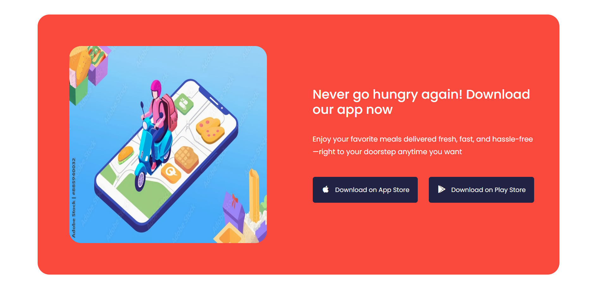

# Food Express - Online Food Ordering Web Application

### Overview

Food Express is a responsive food ordering web application built using HTML, CSS, JavaScript and Bootstrap.

It provides a seamless online ordering experience with cart management, checkout flow, and responsive design.

It allows users to:

1. Browse the menu with multiple categories
2. View total items \& price in a cart modal
3. Order Summary Page - Review selected items, quantities and total before confirming
4. Payment Page - Enter payment details (UI only) to simulate checkout
5. Sign in / Register users
6. View Benefits Section - Highlights why Food Express is the best choice
7. Read Customer Testimonials – See feedback from happy customers
8. Mobile App Download Links – Quick access to Play Store \& App Store
9. About Us Section – Learn more about Food Express
10. Smooth Navigation - Scroll between sections seamlessly
11. Subscribe to the newsletter
12. Experience a fully responsive layout for desktop, tablet and mobile devices

### Tech Stack

* Frontend: HTML5, CSS3, JavaScript (ES6)
* Styling: Bootstrap 5
* Icons: Font Awesome
* Font: Google Fonts (Poppins)
* Data: JSON (products.json for menu items)

### Project Structure

Food-Express/

│── index.html         # Main entry point

│── checkout.html      # Checkout page (cart summary)

│── payment.html       # Order Summary page

│── success.html       # Success page

│── /css

│   ├── styles.css              # Custom Styles

│   └── checkoutStyles.css      # Custom Styles for checkout page

│   └── paymentStyles.css       # Custom Styles for payment page

│   └── successStyles.css       # Custom Styles for success page

│── /js

│   ├── main.js        # Authentication + Cart handling

│   └── menu.js        # Dynamic menu rendering + filtering

│   └── checkout.js    # Checkout page logic (cart summary display, proceed button)

│   └── payment.js     # Payment page logic (form for payment, confirm order)

│   └── success.js     # Success page logic (display order confirmation message, back to home button)

│── /data

│   └── products.json  # Menu data (items, categories, prices, etc.)

│── /images            # Logos, food images, icons

│── README.md          # Documentation

│── App-Screenshots     # Application images

### 

### Getting Started

#### Clone the Repository

git clone https://github.com/banumathimuthumariappan-gif/Online-Food-Ordering-Application.git

cd Online-Food-Ordering-Application

#### 

#### Open in Browser

Open **index.html** in any browser

(No Backend/Server required since this is a static project)

#### Explore Features

* Sign In / Register --> Navbar buttons
* Shop (Menu) --> Add items to cart
* Cart Modal → View, update, or remove items
* Checkout → Opens checkout.html
* Order Summary → Final review of order. Opens summary.html
* Payment Page → Simulated payment input (UI only). Opens payment.html
* Benefits / Testimonials / About / Mobile App Download → Explore static sections

#### Screenshots

Home

About

Benefits

Menu Categories

Menu items

Testimonials

Mobile app section

Footer

Sign In

Register

Cart

Checkout

Payment Main

Payment - Debit/ Credit Card

Payment - UPI ID

Payment - Net Banking

Success

#### Author

Banumathi Muthumariappan

Built using HTML, CSS, JavaScript and Bootstrap

